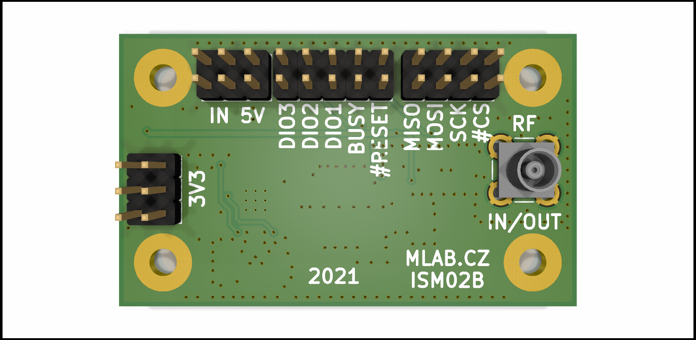
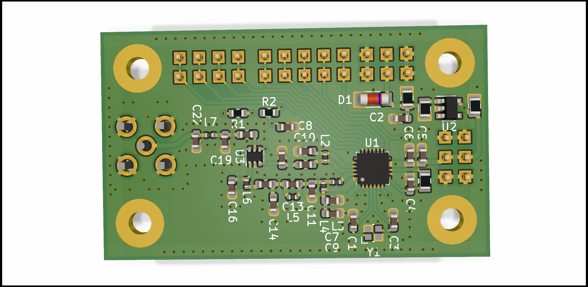

# ISM02 - Long Range, Low Power, sub-GHz RF Transceiver

ISM02A is a telemetry module based on the Semtech SX1262 RF transceiver. This module is widely used in LoRa and other sub-GHz wireless communication applications. It incorporates an RF switch (PE4259) to multiplex RX and TX on a single antenna, making it a compact solution for IoT and telemetry use cases.

## Features
- **RF Transceiver:** [SX1262](https://www.semtech.com/products/wireless-rf/lora-transceivers/sx1262)
  - More power-efficient compared to the SX127x series
  - Additional features with a smaller footprint and fewer external components
  - Operating frequency range: 150 MHz to 960 MHz
  - Supports LoRa and (G)FSK modulation
  - Maximum output power: +22 dBm
  - Low power consumption: 4.2 mA in receive mode
  - Complies with ETSI EN 300 220, FCC CFR 47 Part 15, and other global ISM band regulations
- **RF Switch:** [PE4259](https://www.psemi.com/products/rf-switches/pe4259) UltraCMOS RF switch
  - Frequency range: 10 MHz – 3000 MHz
  - Low insertion loss: 0.35 dB @ 1000 MHz
  - High isolation: 30 dB @ 1000 MHz
  - High ESD tolerance of 2 kV HBM
  - Used to multiplex RX and TX on a single antenna

The module is typically used as a LoRa device and offers flexible wireless communication for various low-power, long-range applications.

## Applications
- Remote sensors
- Agricultural sensors
- HAB/stratospheric balloon tracking and telemetry
- Remote control applications (UAVs, Robots)

## Specifications

| Parameter          | Value                        | Description                      |
|--------------------|------------------------------|----------------------------------|
| Dimensions         | 50.292 x 29.972 mm            | Physical size of the module      |
| Frequency Range    | 150 MHz – 960 MHz             | Supports sub-GHz ISM bands       |
| Modulation Types   | LoRa, FSK                     | Supports LoRaWAN and proprietary |
| Max Output Power   | +22 dBm                       | Using SX1262                     |
| Power Consumption  | 4.2 mA in Rx mode             | Low power consumption            |
| RF Switch          | PE4259                        | Used for antenna multiplexing    |

## Additional Resources
- [SX1262 Datasheet](https://www.semtech.com/products/wireless-rf/lora-transceivers/sx1262)
- [PE4259 Datasheet](https://www.psemi.com/products/rf-switches/pe4259)

